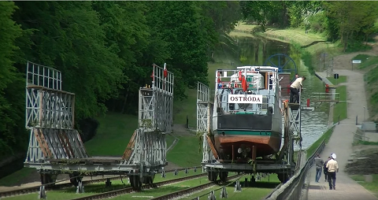
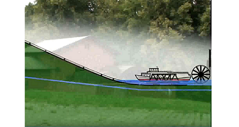

# Title :

**_Kanał Elbląski_**

# Authors :

**Kamil Lipski**

**Karol Rzepka**

**Piotr Zawadka**

# Milestones :

- [x] Stworzenie listy zadań
- [x] Zamodelowanie prostych obiektów
- [ ] Animacja obiektów
- [ ] Udoskonalenie stworzonych wcześniej obiektów
- [x] Teksturowanie
- [ ] Tło
- [ ] Oświetlenie
- [x] Ruch kamery
- [ ] **Prezentacja projektu na spotkaniu nr 7**

# Division of labour :

**Kamil Lipski:**

- modele obiektów,
- teksturowanie.

**Karol Rzepka:**

- oświetlenie,
- tło.

**Piotr Zawadka:**

- animacja,
- kamera.

# Communication:

Do komunikacji używamy narzędzia [Slack] (https://slack.com).

# Scheme :

[Rzut Kanału Elbląskiego] (https://www.youtube.com/watch?v=aLsk3aT9M8g): 9:20 - 18:55.

[Symulacja Kanału Elbląskiego] (https://www.youtube.com/watch?v=j1cH-hl0A9Q): 2:05 - 2:20

# References :

1. [Wstęp do OpenGL - Potok graficzny] (https://www.youtube.com/watch?v=qhrjgsi5kjY)
2. [Wstęp do OpenGL - Pierwszy program] (https://www.youtube.com/watch?v=gUcDom3dB_U)
3. [Wstęp do OpenGL - Bufor wierzchołków] (https://www.youtube.com/watch?v=KUjsJdLOf6E&t)
4. [Wstęp do OpenGL - Atrybuty wierzchołków] (https://www.youtube.com/watch?v=Ucz1-anRT8A)
5. [Wstęp do OpenGL - Teksturowanie] (https://www.youtube.com/watch?v=UonIHdpOPas)
6. [Wstęp do OpenGL - Transformacje geometryczne] (https://www.youtube.com/watch?v=P8kgkOMSZ08&t=4s)